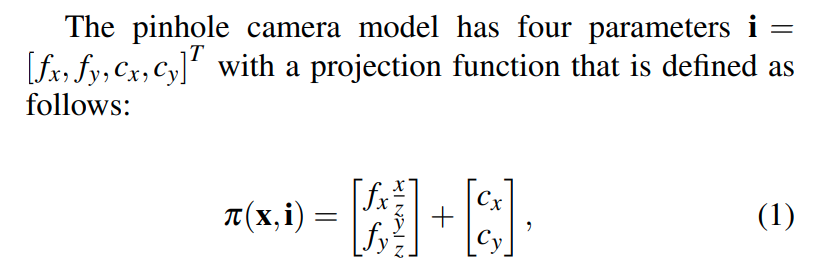
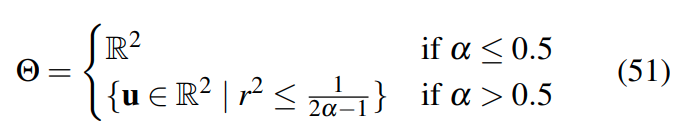

Task 1:

光度标定的结果:

参考: <https://arxiv.org/pdf/1807.08957.pdf>

## 1相机模型: 针孔模型

### 1.1 

### 1.2 反投影 

## 2 Unified Camera Model  (UCM)

### 2.1

### 2.2

## 3.Extended Unified Camera Model  (EUCM)

### 3.1

### 3.2 

## 4.  *** Kannala-Brandt Camera Model (KB)

### 4.1

### 4.2 

## 5. Field-of-View Camera Model  (FOV) 

### 5.1 

### 5.2 

## 5 . Double Sphere Camera Model  (DS)

### 5.1 

### 5.2 

## 6 去畸变内参

Task2 

DSO的初始化是直接基于像素值处理，需要相机曝光时间相对稳定，运动过程不宜过大。 Orb是基于特征的方式处理， 运算消耗相对大一些，速率慢， 初始化过程最好有一定的平移运动。
深层比较待续～～～～

代码参照DSO的过程已经完成，效果却不正常，暂没解决:   ====>  opencv 元素操作的问题

